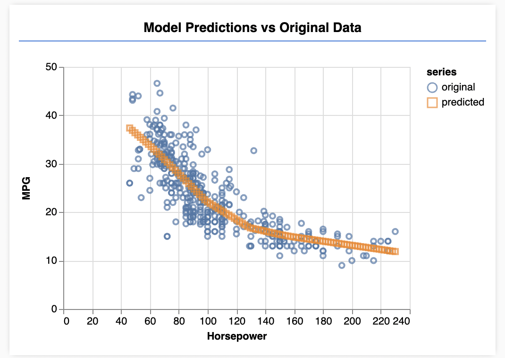

# Tensorflow-Tutorial
 Tensorflow for Javascript Tutorial

## [Making predictions from 2d data](https://www.tensorflow.org/js/tutorials/training/linear_regression)

### Experiments:
1. single input & output layer with 1 unit:
```// Add a single input layer
  model.add(tf.layers.dense({ inputShape: [1], units: 1, useBias: true }));

  // Add an output layer
  model.add(tf.layers.dense({ units: 1, useBias: true }));
  ```


2. Adding a hidden layer
``` 
  // Add a single input layer
  model.add(tf.layers.dense({ inputShape: [1], units: 1, useBias: true }));

  // Add a hidden layer
  model.add(tf.layers.dense({units: 1, activation: 'sigmoid'}))

  // Add an output layer
  model.add(tf.layers.dense({ units: 1, useBias: true }));
```


3. Increasing the units of the input layer:
```
    // Add a single input layer
  model.add(tf.layers.dense({ inputShape: [1], units: 50, useBias: true }));

  // Add a hidden layer
  model.add(tf.layers.dense({units: 1, activation: 'sigmoid'}))

  // Add an output layer
  model.add(tf.layers.dense({ units: 1, useBias: true }));
  ```
  

4. Increasing the units of the hidden layer:
```
    // Add a single input layer
  model.add(tf.layers.dense({ inputShape: [1], units: 1, useBias: true }));

  // Add a hidden layer
  model.add(tf.layers.dense({units: 50, activation: 'sigmoid'}))

  // Add an output layer
  model.add(tf.layers.dense({ units: 1, useBias: true }));
```

  

5. Adding a Relu Hidden Layer & Increasing the units to 50 for all but the output:
```
  // Add a single input layer
  model.add(tf.layers.dense({ inputShape: [1], units: 50, useBias: true }));
  // Add a hidden layer
  model.add(tf.layers.dense({units: 50, activation: 'relu'}))
  // Add a hidden layer
  model.add(tf.layers.dense({units: 50, activation: 'sigmoid'}))
```


